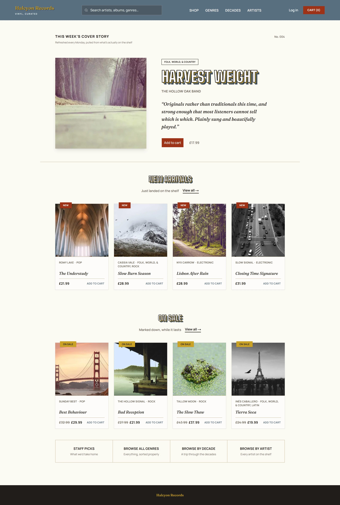
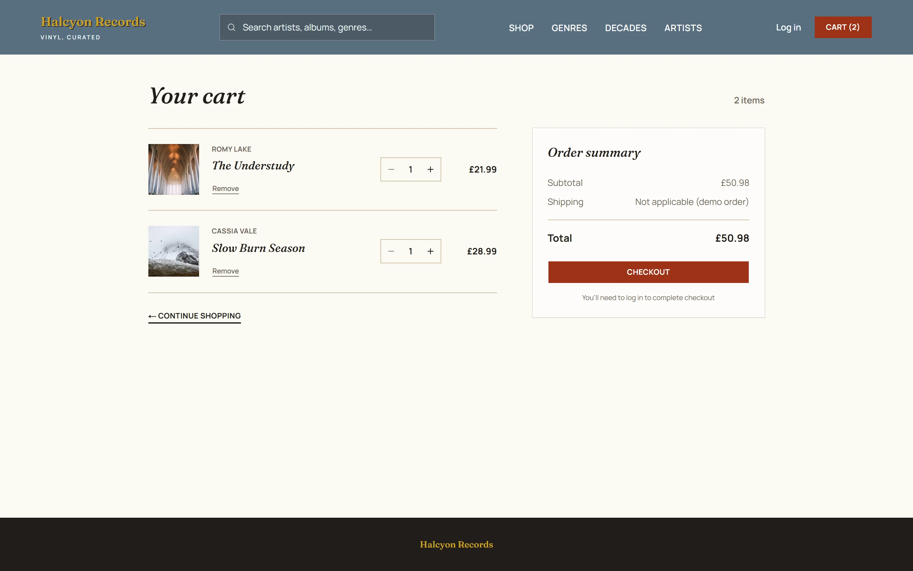
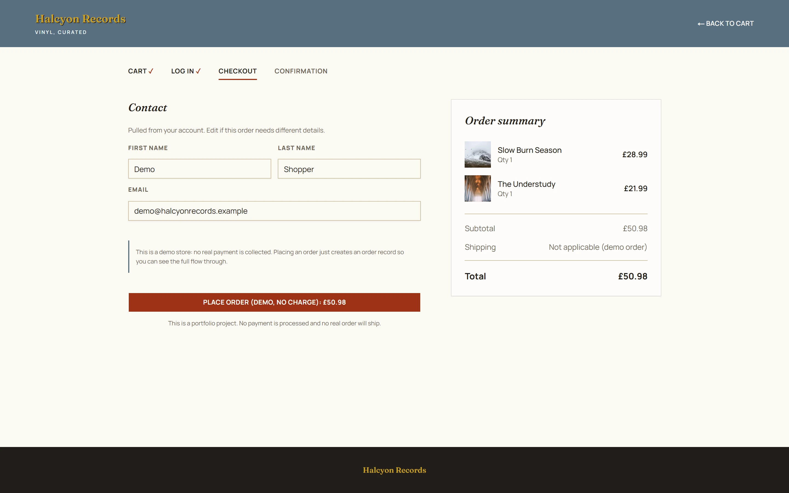
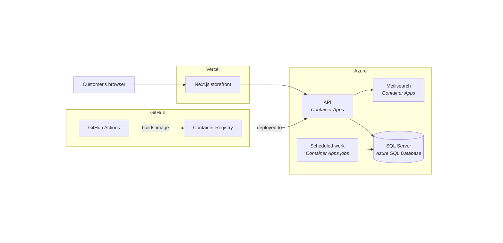
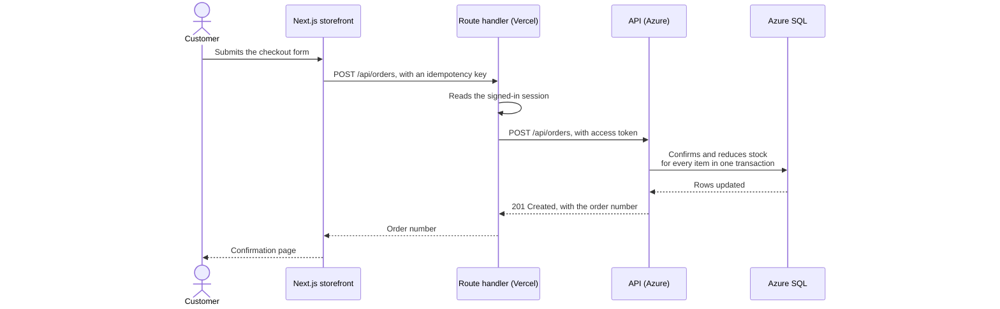
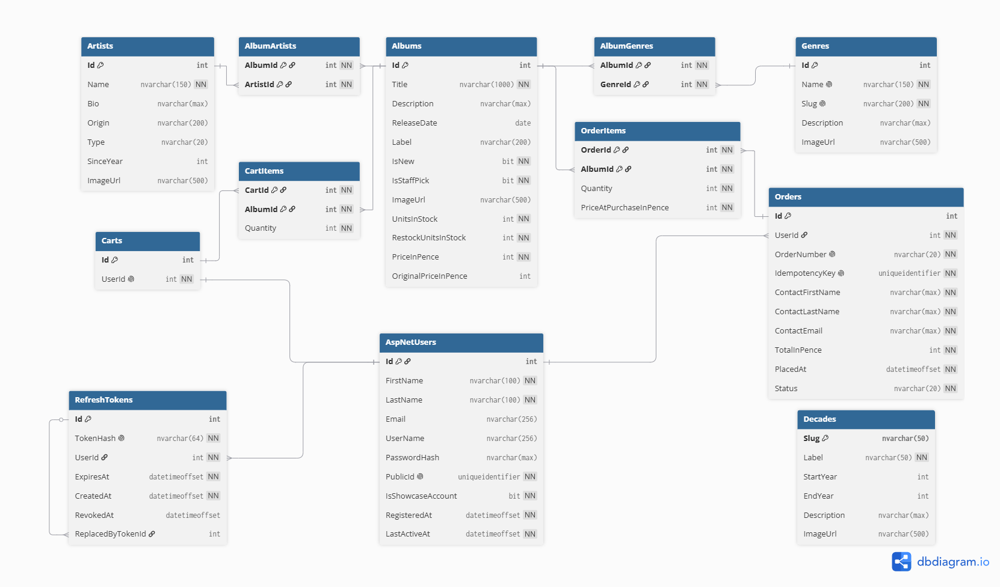

# Halcyon Records

**A full-stack record shop**, built with ASP.NET Core and Next.js. Deployed across Azure and
Vercel, with typo-tolerant search powered by Meilisearch.

[](https://github.com/chris-mech/halcyon-records/actions/workflows/ci.yml)
[](https://github.com/chris-mech/halcyon-records/actions/workflows/deploy-api.yml)


- **Storefront:** https://halcyon-records.vercel.app
- **API reference:** https://api.livelydesert-e3113c84.uksouth.azurecontainerapps.io/scalar

> **The first visit takes about a minute.** The API and the database sleep when nobody is
> using them, and wake on the first request.
>
> **Best viewed on a desktop screen.** A layout for phones and tablets is on the roadmap.



## Overview

Halcyon Records is a fictional but fully functional record shop. The storefront and the API it
depends on are each tested and deployed automatically.

The shop gives you several ways to find a record. Each week the homepage features a different
staff pick, and every artist, genre and decade has its own page with a written introduction.
A search box at the top of the page forgives spelling mistakes, and its results include
suggestions for similar records.

Anyone can browse and add records to a cart, but checking out needs an account. Creating an
account saves the cart, your contact details and order history. Once you are signed in,
placing an order costs nothing. Use the "Try the demo account" button on the login page to
start exploring the whole shop without registering.

## Tech stack

| Area                 | Technologies                                                                                                                                                                         |
| -------------------- | ------------------------------------------------------------------------------------------------------------------------------------------------------------------------------------ |
| Backend              | ASP.NET Core minimal APIs, .NET 10, C#, MediatR, FluentValidation, ErrorOr, Entity Framework Core, ASP.NET Core Identity, JWT bearer authentication, Sqids, Scalar, OpenAPI, Coravel |
| Frontend             | Next.js 16 App Router, React 19, TypeScript, Tailwind CSS v4, shadcn/ui, NextAuth, Zustand, React Hook Form, Zod, openapi-typescript, openapi-fetch, Bun                             |
| Data and search      | SQL Server, Azure SQL Database, Meilisearch, HybridCache                                                                                                                             |
| Local development    | .NET Aspire, Docker Desktop, mkcert                                                                                                                                                  |
| Testing              | xUnit, Testcontainers, Vitest, Testing Library, Playwright, axe-core                                                                                                                 |
| Hosting and delivery | Azure Container Apps, Azure Container Apps Jobs, Azure Key Vault, Vercel, Bicep, GitHub Actions, GitHub Container Registry, Sentry, OpenTelemetry, Azure Application Insights        |

## Features

### Catalogue and search

- **Filtered Browsing** Filters and six sort orders compose into one server-side query, with
  ties broken on ID so paging stays stable.
- **Relevance-Ranked Search** Meilisearch indexes title, artists, genres and release year, then
  discards matches below a relevance threshold.
- **Related Suggestions** A follow-up Meilisearch query returns up to four more albums from the
  genres the results share.
- **Response Caching** A MediatR pipeline behaviour caches opted-in queries in HybridCache, and
  a purchase or restock evicts them by tag.
- **Readable URLs** Links pair a Sqids-encoded ID with a server-generated slug, giving
  `/albums/EpZIDW/static-and-sea`.

### Cart and checkout

- **Guest Carts** A Zustand store holds a signed-out visitor's cart in the browser until
  sign-in saves it to their account.
- **Oversell Protection** Each item's stock check and decrement are one atomic update, and the
  transaction rolls back if any item is short.
- **Idempotent Orders** An idempotency key on every order means a duplicate request receives
  the original order instead of creating a second.
- **Simulated Checkout** Placing an order costs nothing, while still reducing stock globally and
  adding it to the account's order history.

### Accounts and access

- **Persistent User Accounts** An account carries the cart, order history and contact details
  across sessions and devices.
- **Rotating Refresh Tokens** Tokens are stored only as hashes and replaced on every refresh.
  Reusing a revoked one invalidates the whole chain.
- **One-Click Demo** A button on the login page signs visitors into a showcase account that
  already has order history.
- **Rate Limiting** The API partitions a global limit by IP address, and a Vercel firewall rule
  enforces one at the edge.

### Backend engineering

- **Vertical Slice Architecture** Each API operation's endpoint, validator and handler share one
  folder and are registered automatically.
- **Validated Requests** FluentValidation runs as a pipeline behaviour, rejecting bad input
  before any handler is reached.
- **Consistent Error Responses** Expected errors and unhandled exceptions leave the API in the
  same RFC 9457 problem-details shape.
- **Strongly-Typed IDs** Album, artist and genre keys cannot be mistaken for one another.
- **Interactive API Reference** Scalar renders the generated OpenAPI specification as browsable,
  executable documentation, served in production as well as locally.

### Frontend engineering

- **Generated API Client** The frontend's types are derived from the backend's OpenAPI
  specification by openapi-typescript, enforcing a single contract at compile time.
- **Partial Prerendering** A cached static shell renders immediately while the dynamic sections
  stream in behind Suspense boundaries.
- **Generated Metadata** Titles, descriptions and Open Graph tags are set per page, and the
  sitemap is built from live API data.

### Scheduled work

- **Nightly Restock** A cron-scheduled Azure Container Apps Job restores every album to its
  restock level in one update.
- **Account Maintenance** A cleanup job resets the demo account and deletes accounts idle for
  a week or older than 90 days.
- **On-Demand Reindex** The Meilisearch index rebuilds from the database after every deploy or
  when needed.

### Automated testing

- **Isolated Unit Tests** Validators, encoders and pipeline behaviours each have their own
  tests, and frontend components render under Testing Library.
- **Containerised Integration Tests** Handlers run against SQL Server in Docker, with each test
  starting from a clean database.
- **End-to-End Tests** Playwright boots the whole stack through Aspire, then exercises complete
  journeys through the storefront in a browser.

### Build and deploy

- **Gated Pull Requests** Every pull request must pass CI before merging, and only the relevant
  checks are run.
- **Automated Image Publishing** Merging to main builds the API image and pushes it to GitHub
  Container Registry under the commit SHA.
- **Keyless Azure Deploys** GitHub Actions exchanges a short-lived OIDC token for Azure access
  on every deployment.
- **Vaulted Secrets** The container app resolves its keys from Key Vault through a user-assigned
  managed identity.

### Accessibility

- **Automated Accessibility Audits** Playwright runs axe-core against WCAG 2.1 A and AA rules
  across every major route.
- **Semantic Landmarks** Every page is framed by header, nav, main and footer regions.
- **Keyboard Navigation** A skip link moves focus to the main landmark, and every interactive
  element keeps a visible focus state.
- **Screen Reader Support** Covers carry composed alt text, and ARIA marks the current page,
  invalid fields and live updates.

### Observability

- **Traces and Metrics** OpenTelemetry exports request traces and runtime metrics to the Aspire
  dashboard locally and Application Insights in production.
- **Structured Logging** Generated logging methods keep log fields queryable and give every
  entry its own event ID.
- **Error Reporting** Sentry captures exceptions across the storefront's browser, server and
  edge runtimes, tagged by environment.
- **Health Probes** Container Apps polls a liveness endpoint for the process and a readiness
  endpoint covering SQL Server and Meilisearch.

## Screenshots

Catalogue:


Album page:


Cart:



Checkout:



## Architecture

### Project structure

```
halcyon-records/
├── backend/
│   ├── src/     API, Aspire host, shared code, service defaults
│   ├── tests/   unit and integration suites
│   └── tools/   seed data generator and its API clients
├── frontend/    Next.js App Router storefront
├── infra/       Bicep modules for the Azure deployment
└── docs/        database schema and screenshots
```

### Deployed system



A merge to main also triggers Vercel, which builds and deploys the storefront.

### Order flow



The access token travels in an encrypted cookie that page scripts cannot read. Only the route
handler on Vercel decrypts it. If any item is short, the whole order is rolled back.

### Database schema



To maintain readability, only `AspNetUsers` is shown from the standard ASP.NET Identity tables.

`Decades` has no foreign key to `Albums`, since an album's release year already uniquely
determines which decade it belongs to.

Decisions the diagram does not show:

- **Money is stored as whole pence.** Check constraints keep prices and stock counts at or
  above zero.
- **Every order item records the price at the time of purchase.** Any subsequent price updates
  will not alter the amount the customer paid.
- **Every order carries a unique idempotency key.** A resubmitted checkout cannot create a
  duplicate order.
- **Order numbers are issued by a counter in the database.** They are formatted as `HR-123456`,
  and no number is issued twice.
- **Refresh tokens are stored as hashes.** Each token points at the one that replaced it.
  Reusing a revoked token invalidates everything issued after it.
- **Integer keys never appear in a URL or a token.** Albums and artists use a Sqid in their
  URLs, followed by a slug of the title or name. Genres and decades have only a slug. An
  account is identified by a separate `PublicId`, which is also the subject claim in its access
  token.

## Getting started

### Prerequisites

- **.NET 10 SDK**.
- **Docker Desktop**, running before you start the app or the tests.
- **Bun** 1.4 or later.
- **mkcert**, to issue a certificate for local HTTPS.
- A **MediatR licence key**. MediatR 14 requires one, available from
  [mediatr.io](https://mediatr.io/).

### First-time setup

The API serves HTTPS locally, and Bun cannot verify .NET's development certificate even once it
is trusted, because that certificate is its own issuer. mkcert installs a local certificate
authority into the system trust store and issues a certificate from it:

```bash
mkcert -install

cd backend/src/HalcyonRecords.Api
mkdir certs
mkcert -pkcs12 -p12-file certs/kestrel.pfx localhost 127.0.0.1 ::1
dotnet user-secrets set "Kestrel:Certificates:Default:Password" "changeit"
```

`changeit` is mkcert's own default password for the file it writes.

Then add your MediatR key:

```bash
cd backend/src/HalcyonRecords.AppHost
dotnet user-secrets set "Parameters:mediatr-license-key" "your-key-here"
```

Both live outside the repository, so a fresh clone on the same machine needs neither step again.

### Running the app

```bash
dotnet run --project backend/src/HalcyonRecords.AppHost
```

Aspire starts the API, SQL Server, Meilisearch and the storefront together, and opens its
dashboard. The storefront runs at `http://localhost:3000`.

On startup the database is created, migrated and filled with the sample catalogue, and the
search index is rebuilt from it. The signing keys are generated and saved on first run. Nothing
else needs setting up.

### Running the tests

Backend unit and integration tests run from `backend/`, where `global.json` selects the test
runner:

```bash
cd backend
dotnet test
```

Frontend component tests:

```bash
cd frontend
bun install
bun run test
```

The end-to-end tests are kept separate, because Playwright starts the whole stack through
Aspire before it runs:

```bash
cd frontend
bun install
bunx playwright install chromium
bun run test:e2e
```

## Roadmap

- **User Reviews**: customers rate and review records they have bought, with the scores shown
  on each album page.
- **Account Management**: changing a password, resetting a forgotten one, editing personal
  details and closing an account.
- **Availability Alerts**: customers can sign up to hear when a sold-out album is back in stock
  or a new release arrives.
- **Optimistic Updates**: the cart reflects a change immediately without waiting for the server
  to confirm it.
- **Responsive Design**: adapting the storefront design for phones and tablets, with navigation
  built for a small screen.
- **Dark Mode**: a toggleable dark palette that respects the browser or operating system
  setting.
- **Smarter Search**: semantic search that finds records by meaning as well as by keyword.
- **Admin Area**: adding an album, editing its listing and removing it from sale.
- **Sales Dashboard**: the shop owner can view order volume, revenue and best sellers over any
  chosen period.

## Further reading

- [`docs/schema.dbml`](docs/schema.dbml): the database schema written in DBML.
- [`backend/README.md`](backend/README.md): filtering test runs, adding migrations and
  everything else while working on the API.
- [`frontend/README.md`](frontend/README.md): generating the API client, checking types and
  everything else while working on the storefront.
